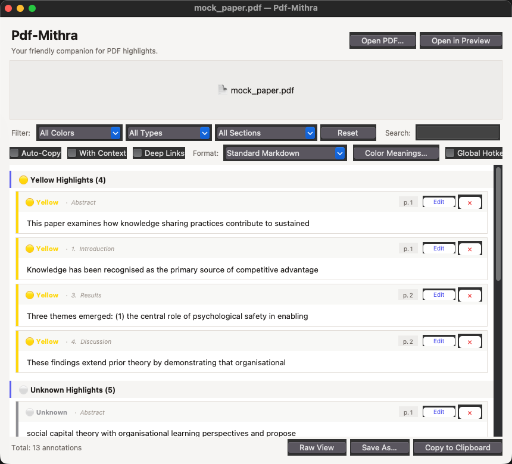
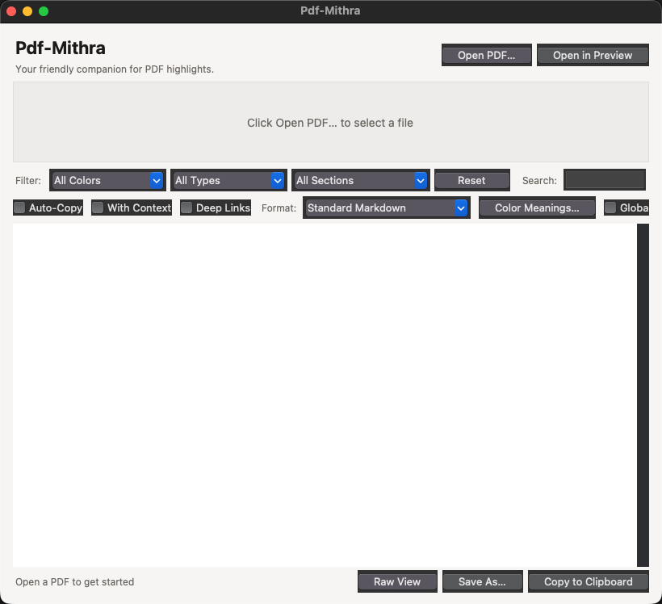

# Pdf-Mithra

**Your friendly companion for PDF highlights.**

Pdf-Mithra is a free desktop app for Mac and Windows that turns your PDF annotations into structured, exportable notes — instantly. Drop in a paper, get back clean notes grouped by section, ready to paste into Obsidian, Notion, Excel, or anywhere else.



---

## What it does

Drop any annotated PDF onto the app. Pdf-Mithra extracts every **highlight**, **underline**, **comment**, and **sticky note**, then displays them as colour-coded cards automatically grouped under the section of the document they came from — Introduction, Methods, Results, and so on.

No manual tagging. No copy-pasting. Just your annotations, organised.

---

## Key features

### Automatic section detection
Pdf-Mithra reads the structure of your PDF and groups annotations under the correct section heading. Works with academic papers, books, and reports.

### Colour meaning system
Label what each highlight colour means to you. Apply a built-in preset in one click:

| Preset | Yellow | Green | Blue | Red | Orange | Purple |
|---|---|---|---|---|---|---|
| **Academic Reading** | Key Argument | Evidence / Data | Definition | Critique | Follow Up | Quote to Cite |
| **Book Notes** | Main Idea | Example | Vocabulary | Disagree | Action Item | Inspiring |
| **Code Review** | Question | Good Pattern | Reference | Bug / Issue | Refactor | Architecture |

Or define your own labels — saved automatically for every future PDF.

### Six export formats

| Format | Best for |
|---|---|
| Standard Markdown | General note-taking |
| Markdown + Metadata | Title, author, page count, word coverage included |
| Obsidian Callout Blocks | Paste straight into your Obsidian vault |
| Markdown Table | Any pipe-table Markdown workflow |
| CSV | Excel, Notion, Airtable, literature matrices |
| HTML Report | Self-contained file with search, colour filters, and print mode — shareable by email or link |

### Batch mode
Drop multiple PDFs at once. Pdf-Mithra processes all of them and lets you export a single combined file — ideal for literature reviews.

### Search and filter
Filter by colour, annotation type, or document section. Full-text search works across highlighted text, section names, and colour meanings.

### Click to open at page *(Mac)*
Click any annotation card to jump directly to that page in Preview.

---

## Platforms

Pdf-Mithra runs on **macOS** and **Windows** with the same features.

---

## Screenshots

| Empty state | Annotations loaded |
|---|---|
|  |  |

---

## Getting started

### Mac

**Requirements:** macOS 12 or later · Python 3.11+ from [python.org](https://www.python.org/downloads/)

> Keep the Pdf-Mithra folder in your home directory — **not** in Desktop or Documents (macOS restricts app access to those folders).

```bash
# 1. Download and move the folder to your home directory, then:
cd ~/Pdf-Mithra

# 2. Install dependencies (once only — takes ~1 minute)
pip install -r requirements.txt
```

Then **double-click `Pdf-Mithra.app`** to launch.

If macOS shows a security warning the first time: right-click the app → **Open** → **Open**.

---

### Windows

**Requirements:** Windows 10 or later · Python 3.11+ from [python.org](https://www.python.org/downloads/)

> During Python installation, tick **"Add Python to PATH"**.

**Double-click `Pdf-Mithra.bat`.**

On first run it creates a virtual environment and installs all dependencies automatically (~1 minute). Every subsequent double-click just opens the app.

---

## Usage

1. **Drag and drop** one or more PDFs onto the drop zone — or click **Open PDF** to browse
2. Annotations appear as **colour-coded cards**, grouped by section
3. Use the **Filter bar** to narrow by colour, type, or section — or use **Search**
4. Click **Color Meanings…** to label your highlight colours (or apply a preset)
5. Pick a format from the **Format** dropdown
6. Click **Copy to Clipboard** or **Save As…** to export
7. *(Mac)* Click any card to jump to that page in Preview

---

## Dependencies

| Package | Purpose |
|---|---|
| [PyMuPDF](https://pymupdf.readthedocs.io/) | PDF parsing and annotation extraction |
| [tkinterdnd2](https://github.com/pmgagne/tkinterdnd2) | Drag-and-drop support |
| [pyperclip](https://github.com/asweigart/pyperclip) | Clipboard access |
| [pynput](https://pynput.readthedocs.io/) *(Mac only)* | Global hotkey support |

All installed automatically by the setup steps above.

---

## Free to use. Always.
